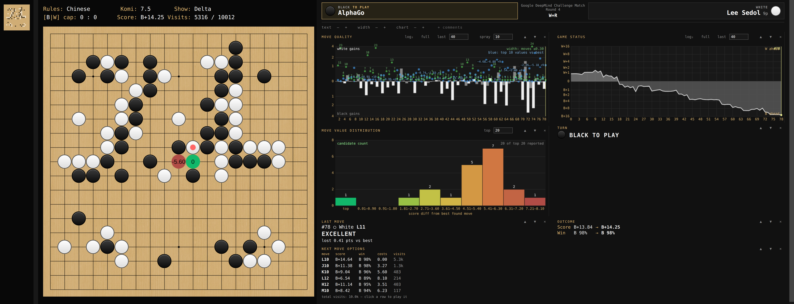
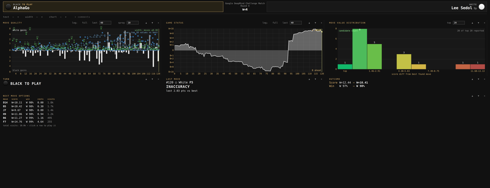

# ogatak-clear

A fork of [rooklift/ogatak](https://github.com/rooklift/ogatak) focused on
making KataGo's analysis immediately comprehensible during game review.
Upstream Ogatak made this fork possible by providing an independent KataGo
GUI with a board, SGF editor, game-format support, and engine integration.
ogatak-clear retains that foundation and adds review displays, alternative
defaults, and live controls. Thanks to the upstream author and contributors
for creating and maintaining Ogatak.
The detailed requirements and rationale are in [PRODUCT.md](PRODUCT.md).

_Lee Sedol–AlphaGo Game 4 at move 78. Every position in the game was
autoanalyzed. Width is `1` here, while the blue spray shows that the
next-ranked alternative is `1.61` points worse; see the
[source and analysis details](docs/sample-games/README.md)._

* Fork of an analysis GUI for [KataGo](https://github.com/lightvector/KataGo).
* Stone and board graphics modified from [Sabaki](https://github.com/SabakiHQ/Sabaki), with thanks.
* Concept borrowed from [Lizzie](https://github.com/featurecat/lizzie), with influence from [KaTrain](https://github.com/sanderland/katrain), [CGoban](https://www.gokgs.com/download.jsp), and [LizGoban](https://github.com/kaorahi/lizgoban).

## What ogatak-clear adds

* Adds a full-height, resizable **Move Report** panel. Its reorderable and
  hideable cards show the turn, last-move verdict, before/after outcome,
  clickable next-move options, comments, and three analysis charts. When an
  SGF includes player names, a persistent strip prominently identifies Black
  and White, their ranks, the active player, and available game context.
* Adds separate **Move Quality** and **Game Status** histories. Move Quality
  uses one contiguous bar per move with White gains always upward and Black
  gains downward. Game Status separately shows who was ahead. Both have
  labeled axes, linear/log-base-2 toggles, click-to-navigate behavior, and
  follow the currently selected variation when rewinding or branching.
  Each independently toggles between full history and a configurable
  sliding window, defaulting to the last 40 moves.
* Adds **Move Value Distribution**, a ten-bucket histogram of the current
  top-N candidates, and **Width**, the historical count of moves within
  `0.30` points of best at each analyzed position. Width describes how
  broad the strategic possibilities are: a sustained value of `1` means
  the near-best path has become narrow, while `8` or more means many
  competitive choices remain. A clustered blue spray alongside Width shows
  the historical top candidate values relative to `0.00`, with an adjustable
  top-N limit and adaptive labels.
* Labels point values with the color they favor (`B+2.30`, `W+0.50`) and
  shows move quality as unsigned points lost versus the best available
  move. On-board candidate labels default to this score-relative Delta.
* Adds **Display → Candidate moves: points from best**. Its default `0.30`
  threshold shows every qualifying move regardless of visits. **Display →
  Always show next-move eval** (default on) also draws the game's next move
  when KataGo has evaluated it, even if it is past that cutoff.
  Candidate circles use selectable continuous value gradients.
* Makes the right-panel layout adjustable while the app is running: section
  order and visibility, text size, card width, chart height, chart scale,
  and distribution size all persist in `config.json`. Comments are a panel
  card rather than a separately reserved row.
* Protects a node's strongest analysis from being overwritten by an early
  lower-visit report when revisiting it. Results are compared only when the
  engine, model, rules, komi, board state, move history, and search settings
  match. This preserves analysis snapshots; it does not resume KataGo's
  terminated MCTS tree.
* Makes normal pondering configurable under **Analysis → Ponder visits**,
  independently of autoanalysis.
* Adds fullscreen (`Alt+Enter`) and persistent whole-UI zoom (`Ctrl+=`,
  `Ctrl+-`, `Ctrl+Shift+0`).

_The Move Report at move 120: move-by-move quality and Width, game status,
the current candidate distribution, and directly comparable next moves._

## Capabilities from upstream Ogatak

* Direct interface with a compact set of dependencies.
* Includes common Lizzie-style analysis features.
* Includes an SGF editor.
* Handles SGF handicaps and mid-game board edits.
* Can load NGF, GIB, and UGI files.
* Runs from source with Electron as its only application dependency.

## Runtime notes

* KataGo and a network weights file must be installed separately.
* The application runs on Electron.

## Setup

* Clone this repository and install Electron without adding it to the project manifest: `cd src && npm install --no-save electron`.
* Run from the repository root with `src/node_modules/.bin/electron src`.
* Download and unpack KataGo and a KataGo weights file.
* In Ogatak, select the menu item `Setup` `-->` `Locate KataGo...` (and locate katago.exe)
* In Ogatak, select the menu item `Setup` `-->` `Choose network...` (and locate the weights file)

## Performance tips

* The setting to request per-move ownership info from KataGo (see `Analysis` menu) is rather demanding and you should turn it off if you experience any lag.
* Alternatively, consider changing the engine report rate (see `Setup` menu) from the default 0.1 (which is the most intense) to something else.
* Due to a complex interaction between KataGo's algorithm and KataGo's cache, the `wide root noise` setting can cause a reduction in perceived performance if you use the GUI in a certain way, especially if you commonly click through the top move. It may also affect whole-file analysis speeds.
* Candidate visibility is not a search limit. A `0.30` display cutoff does not stop KataGo from considering moves outside that range.

## About the analysis config file

* KataGo requires an analysis config file. Such a file is provided with KataGo as `analysis_example.cfg`, and Ogatak will use this if it's present, unless you explicitly specify a different file. You might find that changing some settings therein leads to better (or worse) performance. Some have found [these settings](https://github.com/sanderland/katrain/blob/master/katrain/KataGo/analysis_config.cfg) chosen by the KaTrain author to be a bit faster.

## Translations

* At the moment, it is possible to translate most of the menu items and some of the GUI text. See `src/modules/translations.js` for instructions.
* Thanks to the following translators: ParmuzinAlexander, CGLemon, Bandysol.

## Upstream project contact

* The upstream author can often be found on the [Computer Go Discord](https://discord.com/invite/5vacH5F).

## License

This fork remains licensed under the GNU Affero General Public License v3.0.
