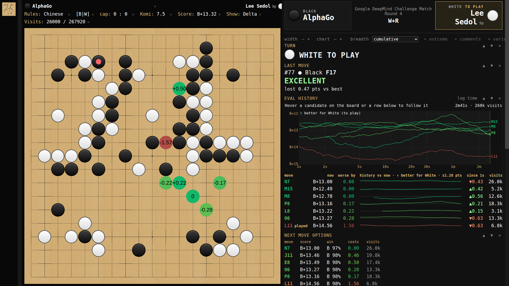
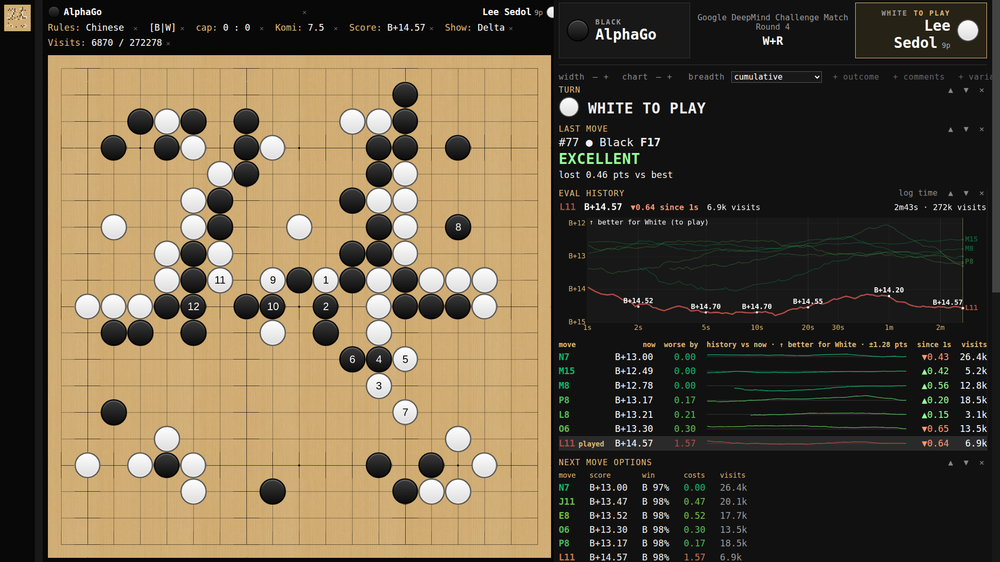
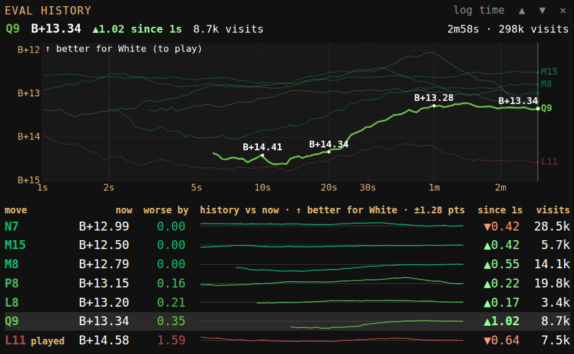

# ogatak-clear

A fork of [rooklift/ogatak](https://github.com/rooklift/ogatak) focused on
making KataGo's analysis immediately comprehensible during game review.
Upstream Ogatak provides an independent KataGo GUI with a board, SGF editor,
game-format support, and engine integration; ogatak-clear keeps that
foundation and adds review displays, alternative defaults, and live controls.
Thanks to the upstream author and contributors for creating and maintaining
Ogatak. The detailed requirements and rationale are in
[PRODUCT.md](PRODUCT.md).

_Lee Sedol–AlphaGo Game 4, just before Lee's move 78, after a 2½-minute
search. The board shows the engine's best move (`0`), the five closest
alternatives, and the move Lee actually played (L11, red). Eval history, on
the right, plots each of those moves' values over the whole search on a
log-time axis; the table under it gives every move a sparkline and its change
since the first second. See the
[source and analysis details](docs/sample-games/README.md)._

* Fork of an analysis GUI for [KataGo](https://github.com/lightvector/KataGo).
* Stone and board graphics modified from [Sabaki](https://github.com/SabakiHQ/Sabaki), with thanks.
* Concept borrowed from [Lizzie](https://github.com/featurecat/lizzie), with influence from [KaTrain](https://github.com/sanderland/katrain), [CGoban](https://www.gokgs.com/download.jsp), and [LizGoban](https://github.com/kaorahi/lizgoban).

## Recent additions

* **Best + N candidates**: show a fixed number of options, always including
  the move actually played, instead of every move within a points cutoff.
* **Eval history**: every candidate's value over the whole search, with
  sparklines and a chart that follows whichever move you hover, so you can
  see which moves are still moving and where the values settle.
* **No flicker**: moves KataGo has only just started exploring no longer
  flash into the Best + N places for a tenth of a second.
* **Candidate colours restored in Next Move Options**: the page's security
  policy had been silently blocking the table's value colours.

## Candidate moves on the board

* Each circle is labelled with Delta: points worse than the best available
  move from here (`0` = best), never a visit count. Being behind in the game
  doesn't make the best available move look bad.
* **Display → Candidate moves shown** chooses which circles appear:
  * **Points from best** (`≤ 0.30` … `≤ 8.00`, or All; default `≤ 0.30`)
    shows every move within that many points of best, regardless of visits.
    **Display → Always show next-move eval** (default on) also draws the
    game's next move when KataGo has evaluated it, even past the cutoff.
  * **Best + N moves** (`Best only`, `Best + 1 move` … `Best + 10 moves`;
    default N = 4) always shows the game's actual next move when KataGo has
    evaluated it, the best move, and the N next-best moves by score. A move
    needs 50 visits (`candidate_min_visits`) before it can take one of those
    places. Over 32 measured positions, that cut moves flashing in and out
    from 346 to 42.
* Circles use one continuous colour gradient from best to worst, chosen under
  **Display → Gradient**. With a points cutoff, the cutoff is the scale; with
  All or Best + N, the scale runs to the worst move shown, the played move
  included, so a clearly worse move never shares a colour with a better one.

## Eval history

_Hovering L11 shows its principal variation on the board and follows it in
Eval history: its line is drawn on top and labelled with what KataGo said
about it at each time tick, and the header gives its value now, its change
since the first second, and its visits._

* A Move Report card that records how every candidate's value moves during
  the current position's search, from the first second to however long you
  let KataGo think.
* The chart plots each shown candidate's score for the player to move (up is
  better for them, and says so) in its board colour against time since the
  search started. Time is logarithmic by default, so both the early swings
  and the long settling stay visible; the card header toggles linear time.
* Hover a candidate on the board, or a row in the table, to follow that
  move: its line is drawn thick with the others faded, its value is labelled
  at 1 s, 2 s, 5 s, 10 s, 20 s, 1 min, and so on, and its current value,
  change, and visits lead the card in large type.
* The table lists the same moves with value now, points worse than best, a
  sparkline, the change since 1 s (▲ better / ▼ worse for the player to move;
  bold from 1 point), and visits. Sparklines share one scale of distance from
  each move's current value, so settled moves are flat and "hot" moves
  visibly swing. Click a row to play the move.
* Lines start at 1 s and once a move has 50 visits, because earlier values
  are mostly noise. Each search keeps its own history, a few hundred samples
  even for an hour-long search. Revisiting a position keeps showing the
  earlier, longer search until the new one overtakes it, just like the
  analysis itself.

_Following Q9, the most-changed move in the table (bold ▲1.02). Its line
starts after about six seconds, once it had 50 visits, and KataGo's value for
it then improved by about a point for White over the next three minutes._

## The Move Report panel

* A full-height, resizable panel of reorderable, hideable cards: turn,
  last-move verdict, before/after outcome, clickable next-move options, Eval
  history, comments, and the analysis charts below. When an SGF includes
  player names, a persistent strip prominently identifies Black and White,
  their ranks, the active player, and available game context.
* Point values are labelled with the colour they favour (`B+2.30`, `W+0.50`),
  and move quality is always unsigned points lost versus the best available
  move: a verdict such as **MISTAKE** over
  `lost 3.20 pts vs best — best was D4 (5 lines away)`.
* The layout adjusts while the app runs: section order and visibility, card
  width, chart height, chart scales, and distribution size all persist in
  `config.json`. All text follows one app-wide six-step type scale set by
  **Sizes → Info font**, so every card and chart label scales together.
  Comments are a card rather than a separately reserved row.

## History charts

_The Move Report at move 120: move-by-move quality and Width, game status,
the current candidate distribution, and directly comparable next moves._

* **Move Quality** draws one contiguous bar per move, White's gains always
  upward and Black's downward. **Game Status** separately shows who was
  ahead. Both have labelled axes, linear/log-base-2 toggles, and
  click-to-navigate. They follow the currently selected variation when you
  rewind or branch, and each toggles between full history and a sliding
  window (default: the last 40 moves).
* **Choice Breadth History** and **Current Candidate Values** show how many
  good options each position had. One persisted picker switches both between
  five complete views: focus-plus-tail, fixed bands, cumulative counts, rank
  landscapes, and a decision summary. Width is the count of moves within
  `0.30` points of best; tail bands expose alternatives just beyond that and
  large gaps to the next credible move. Width and candidate costs are saved
  in the SGF, so the history survives reopening the file.

## Analysis handling

* A node keeps its strongest analysis: an early, lower-visit report from
  revisiting a position never overwrites it. Results are compared only when
  the engine, model, rules, komi, board, move history, and search settings
  match. This preserves analysis snapshots; it does not resume KataGo's
  terminated search tree.
* **Analysis → Ponder visits** sets the normal analysis limit independently
  of autoanalysis.
* Fullscreen (`Alt+Enter`) and persistent whole-UI zoom (`Ctrl+=`, `Ctrl+-`,
  `Ctrl+Shift+0`).

## Capabilities from upstream Ogatak

* Direct interface with a compact set of dependencies.
* Includes common Lizzie-style analysis features.
* Includes an SGF editor.
* Handles SGF handicaps and mid-game board edits.
* Can load NGF, GIB, and UGI files.
* Runs from source with Electron as its only application dependency.

## Runtime notes

* KataGo and a network weights file must be installed separately.
* The application runs on Electron.

## Setup

* Clone this repository and install Electron without adding it to the project manifest: `cd src && npm install --no-save electron`.
* Run from the repository root with `src/node_modules/.bin/electron src`.
* Download and unpack KataGo and a KataGo weights file.
* In Ogatak, select the menu item `Setup` `-->` `Locate KataGo...` (and locate katago.exe)
* In Ogatak, select the menu item `Setup` `-->` `Choose network...` (and locate the weights file)
* The pure-logic tests run with plain Node: `node src/modules/utils.test.js`, `node src/modules/eval_history.test.js`, and `node src/modules/candidate_profile.test.js`.

## Performance tips

* The setting to request per-move ownership info from KataGo (see `Analysis` menu) is rather demanding and you should turn it off if you experience any lag.
* Alternatively, consider changing the engine report rate (see `Setup` menu) from the default 0.1 (which is the most intense) to something else.
* Due to a complex interaction between KataGo's algorithm and KataGo's cache, the `wide root noise` setting can cause a reduction in perceived performance if you use the GUI in a certain way, especially if you commonly click through the top move. It may also affect whole-file analysis speeds.
* Candidate visibility is not a search limit. A `0.30` display cutoff or a Best + N setting does not stop KataGo from considering other moves.

## About the analysis config file

* KataGo requires an analysis config file. Such a file is provided with KataGo as `analysis_example.cfg`, and Ogatak will use this if it's present, unless you explicitly specify a different file. You might find that changing some settings therein leads to better (or worse) performance. Some have found [these settings](https://github.com/sanderland/katrain/blob/master/katrain/KataGo/analysis_config.cfg) chosen by the KaTrain author to be a bit faster.

## Translations

* At the moment, it is possible to translate most of the menu items and some of the GUI text. See `src/modules/translations.js` for instructions.
* Thanks to the following translators: ParmuzinAlexander, CGLemon, Bandysol.

## Upstream project contact

* The upstream author can often be found on the [Computer Go Discord](https://discord.com/invite/5vacH5F).

## License

This fork remains licensed under the GNU Affero General Public License v3.0.
