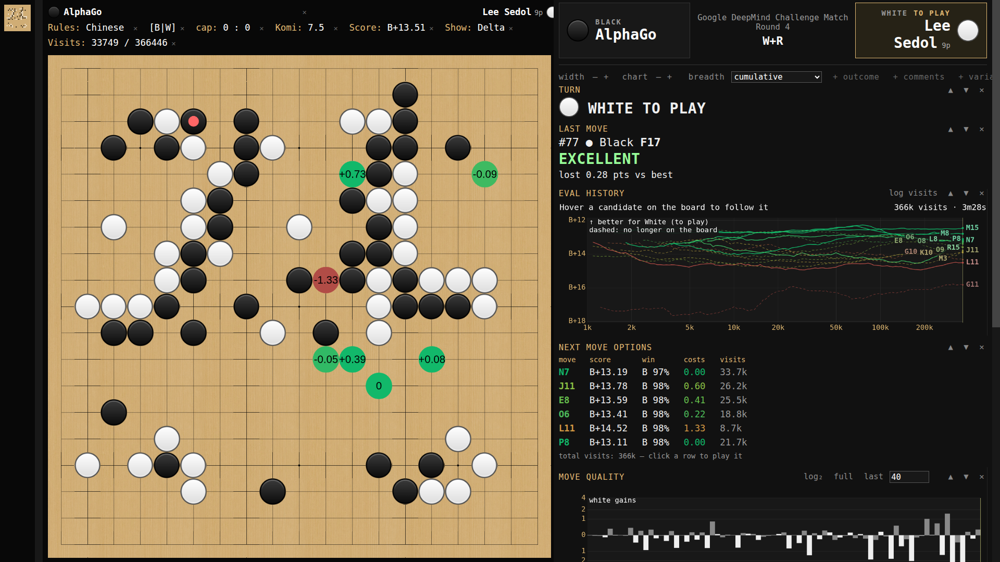
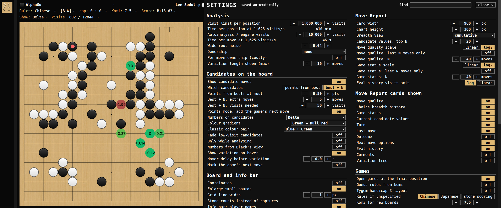
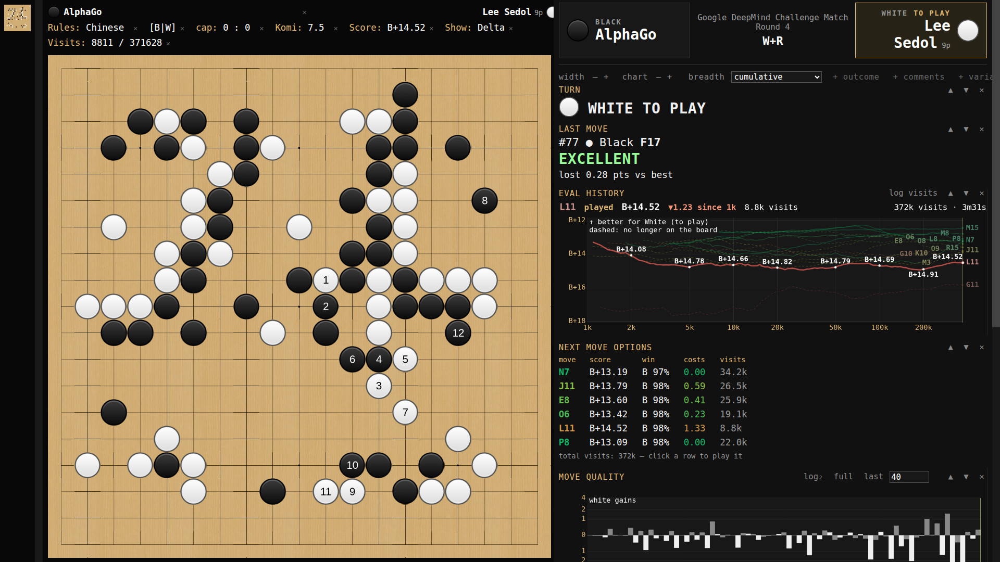
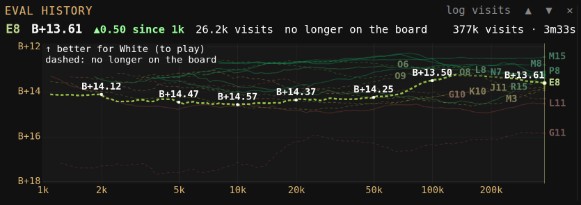
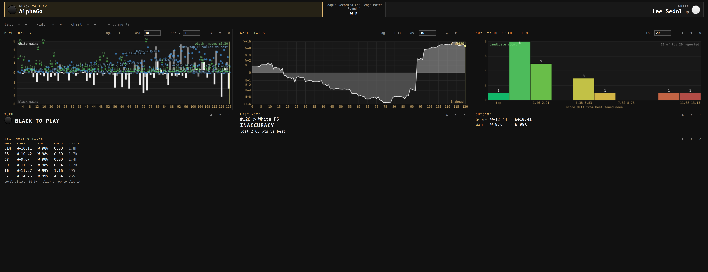

# ogatak-clear

A fork of [rooklift/ogatak](https://github.com/rooklift/ogatak) focused on
making KataGo's analysis immediately comprehensible during game review.
Upstream Ogatak provides an independent KataGo GUI with a board, SGF editor,
game-format support, and engine integration; ogatak-clear keeps that
foundation and adds review displays, alternative defaults, and live controls.
Thanks to the upstream author and contributors for creating and maintaining
Ogatak. The detailed requirements and rationale are in
[PRODUCT.md](PRODUCT.md).

_Lee Sedol–AlphaGo Game 4, just before Lee's move 78, after a three-minute
search. The board shows the engine's best move (`0`), the five closest
alternatives, and the move Lee actually played (L11, red). Eval history, on
the right, plots the value of every move shown during the search against the
search's visits; moves that have since left the board are dashed. See the
[source and analysis details](docs/sample-games/README.md)._

* Fork of an analysis GUI for [KataGo](https://github.com/lightvector/KataGo).
* Stone and board graphics modified from [Sabaki](https://github.com/SabakiHQ/Sabaki), with thanks.
* Concept borrowed from [Lizzie](https://github.com/featurecat/lizzie), with influence from [KaTrain](https://github.com/sanderland/katrain), [CGoban](https://www.gokgs.com/download.jsp), and [LizGoban](https://github.com/kaorahi/lizgoban).

## Recent additions

* **Explored moves**: play a move yourself, let KataGo search it, and step
  back. The move now shows the value that search found, even when the
  position's own search barely looked at it or never did.
* **Every variation's next move**: Display → Show every variation's next
  move puts the next move of every line you've played from a position on the
  board and in Next Move Options, in either candidate mode.
* **Shorter loss labels**: a candidate 0.67 points worse than the best reads
  `67`; one that loses nothing reads ☻.
* **Settings**: every setting on one page, with typed values, a find box,
  and the live board beside it. The visit limit per position accepts any
  number, and the page shows how long it takes at your engine's speed.
* **Best + N candidates**: show a fixed number of options, always including
  the move actually played, instead of every move within a points cutoff.
* **Eval history**: every candidate's value over the whole search, charted
  against visits, with a label on every line and a hover that follows any
  move, so you can see which moves are still moving and where values settle.
* **No flicker**: moves KataGo has only just started exploring no longer
  flash into the Best + N places for a tenth of a second.
* **Candidate colours restored in Next Move Options**: the page's security
  policy had been silently blocking the table's value colours.

## Settings

_Settings open during analysis. The board and its candidates stay live on
the left. The Analysis card shows that the 1,000,000-visit limit takes
about 10 minutes at the engine's current 1,625 visits/s._

* Open it with File → Settings... (`Ctrl+,`) or **⚙ settings** on the Move
  Report bar. Close it with Esc, `Ctrl+,`, or its close button.
* Every setting from the menus is here, grouped into cards, along with
  several that used to be `config.json`-only: the Best + N visit minimum,
  default rules and komi, and the variation-tree height. Each row shows its
  current value.
* Numbers are typed (`1,000,000`, `1m`, `250k`); − / + and the arrow keys
  step through the usual presets. Changes apply at once and save
  themselves; there is no Apply button.
* **Find** narrows the page to matching settings. Typing in a field never
  triggers board shortcuts, and Space still toggles analysis after you
  click a setting.
* The menus still work as before and stay in step with Settings.

## Candidate moves on the board

* Each circle is labelled with its loss in hundredths of a point against the
  best available move from here: `67` means 0.67 points worse, and ☻ means
  nothing lost. Bigger is worse, and the colour says the same. It's never a
  visit count. Being behind in the game doesn't make the best available move
  look bad. Next Move Options' costs column uses the same numbers.
* **Display → Candidate moves shown** chooses which circles appear:
  * **Points from best** (`≤ 0.30` … `≤ 8.00`, or All; default `≤ 0.30`)
    shows every move within that many points of best, regardless of visits.
  * **Best + N moves** (`Best only`, `Best + 1 move` … `Best + 10 moves`;
    default N = 4) shows the best move and the N next-best moves by score.
    A move needs 50 visits (`candidate_min_visits`) before it can take one
    of those places. Over 32 measured positions, that cut moves flashing in
    and out from 346 to 42.
* **Display → Show every variation's next move** (default on) adds, in
  either mode, the next move of every line that continues from here: the
  game's own next move and every variation you've played. Each shows its
  best-known value, even past the cutoff. Next Move Options lists them after
  its top six. A move with no value yet (never searched, and never tried by
  this position's search) isn't drawn; **Next move markers** shows where it
  is.
* Circles use one continuous colour gradient from best to worst, chosen under
  **Display → Gradient**. With a points cutoff, the cutoff is the scale; with
  All or Best + N, the scale runs to the worst move shown, the played move
  included, so a clearly worse move never shares a colour with a better one.
* A move you played and searched yourself carries that search's value, once
  that search has more visits than the current position's search gave the
  move. On the board it looks like any other candidate; **Display → Mark
  explored moves** draws it as a rounded square instead. Next Move Options
  marks it "explored". The rules are in [PRODUCT.md](PRODUCT.md),
  "Explored moves".

## Eval history

_Hovering L11 shows its principal variation on the board and follows it in
Eval history: its line is drawn on top and labelled with what KataGo said
about it at each visits tick, and the header gives its value now, its change
since 1k visits, and its own visits._

* A Move Report card charting how every candidate's value moves as the
  current position's search goes on, from 1,000 visits to however long you
  let KataGo think.
* The x axis is the search's total visits, logarithmic by default so both the
  early swings and the long settling stay visible (the card header toggles
  linear). Visits rather than time, because visits are the search's real
  progress; time depends on the machine and on whatever else uses the GPU.
* The y axis is each move's score for the player to move: up is better for
  them, and the chart says so. Each line has its move's board colour.
* Every move shown on the board during the search keeps its line after it
  drops out of the Best + N places; those lines turn thin and dashed. Every
  line is labelled with its move: at its end where there is room, otherwise
  on the line itself.
* Hover a candidate on the board to follow it: its line is drawn thick with
  the others faded, its value is labelled at 2k, 5k, 10k visits and so on,
  and its value now, change, and visits lead the card in large type.
* A move's line starts once it has 50 visits, because earlier values are
  mostly noise. Each search keeps its own history, a few hundred samples even
  for an hour-long search. Revisiting a position keeps showing the earlier,
  longer search until the new one overtakes it, just like the analysis
  itself.

_Following E8 after it has left the board. KataGo's value for it improved by
half a point for White from 1k visits to 377k, but other moves improved more,
so it lost its Best + 5 place; its line stays, dashed, like every other move
that was once shown._

## The Move Report panel

* A full-height, resizable panel of reorderable, hideable cards: turn,
  last-move verdict, before/after outcome, clickable next-move options, the
  Eval history chart, comments, and the history charts below. When an SGF includes
  player names, a persistent strip prominently identifies Black and White,
  their ranks, the active player, and available game context.
* Point values are labelled with the colour they favour (`B+2.30`, `W+0.50`),
  and move quality is always unsigned points lost versus the best available
  move: a verdict such as **MISTAKE** over
  `lost 3.20 pts vs best — best was D4 (5 lines away)`.
* The layout adjusts while the app runs: section order and visibility, card
  width, chart height, chart scales, and distribution size all persist in
  `config.json`. All text follows one app-wide six-step type scale set by
  **Sizes → Info font**, so every card and chart label scales together.
  Comments are a card rather than a separately reserved row.

## History charts

_The Move Report at move 120: move-by-move quality and Width, game status,
the current candidate distribution, and directly comparable next moves._

* **Move Quality** draws one contiguous bar per move, White's gains always
  upward and Black's downward. **Game Status** separately shows who was
  ahead. Both have labelled axes, linear/log-base-2 toggles, and
  click-to-navigate. They follow the currently selected variation when you
  rewind or branch, and each toggles between full history and a sliding
  window (default: the last 40 moves).
* **Choice Breadth History** and **Current Candidate Values** show how many
  good options each position had. One persisted picker switches both between
  five complete views: focus-plus-tail, fixed bands, cumulative counts, rank
  landscapes, and a decision summary. Width is the count of moves within
  `0.30` points of best; tail bands expose alternatives just beyond that and
  large gaps to the next credible move. Width and candidate costs are saved
  in the SGF, so the history survives reopening the file.

## Analysis handling

* A node keeps its strongest analysis: an early, lower-visit report from
  revisiting a position never overwrites it. Results are compared only when
  the engine, model, rules, komi, board, move history, and search settings
  match. This preserves analysis snapshots; it does not resume KataGo's
  terminated search tree.
* The visit limit per position is independent of autoanalysis. It is set to
  any number in Settings, or from presets under **Analysis → Ponder visits**.
  A new limit applies to the running search immediately.
* Fullscreen (`Alt+Enter`) and persistent whole-UI zoom (`Ctrl+=`, `Ctrl+-`,
  `Ctrl+Shift+0`).

## Capabilities from upstream Ogatak

* Direct interface with a compact set of dependencies.
* Includes common Lizzie-style analysis features.
* Includes an SGF editor.
* Handles SGF handicaps and mid-game board edits.
* Can load NGF, GIB, and UGI files.
* Runs from source with Electron as its only application dependency.

## Runtime notes

* KataGo and a network weights file must be installed separately.
* The application runs on Electron.

## Setup

* Clone this repository and install Electron without adding it to the project manifest: `cd src && npm install --no-save electron`.
* Run from the repository root with `src/node_modules/.bin/electron src`. The first run downloads the Electron binary, so it takes longer.
* On Linux distributions that restrict unprivileged user namespaces (Ubuntu 24.04 and later), Electron stops at startup with "The SUID sandbox helper binary was found, but is not configured correctly". Give the helper the owner and mode it asks for, and repeat this after reinstalling or updating Electron:
  `sudo chown root:root src/node_modules/electron/dist/chrome-sandbox && sudo chmod 4755 src/node_modules/electron/dist/chrome-sandbox`.
  Without sudo, start Ogatak with `src/node_modules/.bin/electron src --no-sandbox` instead.
* Download and unpack KataGo and a KataGo weights file.
* In Ogatak, select the menu item `Setup` `-->` `Locate KataGo...` (and locate the KataGo executable)
* In Ogatak, select the menu item `Setup` `-->` `Choose network...` (and locate the weights file)
* The pure-logic tests run with plain Node: `node src/modules/utils.test.js`, `node src/modules/eval_history.test.js`, `node src/modules/candidate_profile.test.js`, `node src/modules/settings_schema.test.js`, and `node src/modules/explored.test.js`.

## Performance tips

* The setting to request per-move ownership info from KataGo (see `Analysis` menu) is rather demanding and you should turn it off if you experience any lag.
* Alternatively, consider changing the engine report rate (see `Setup` menu) from the default 0.1 (which is the most intense) to something else.
* Due to a complex interaction between KataGo's algorithm and KataGo's cache, the `wide root noise` setting can cause a reduction in perceived performance if you use the GUI in a certain way, especially if you commonly click through the top move. It may also affect whole-file analysis speeds.
* Candidate visibility is not a search limit. A `0.30` display cutoff or a Best + N setting does not stop KataGo from considering other moves.

## About the analysis config file

* KataGo requires an analysis config file. Such a file is provided with KataGo as `analysis_example.cfg`, and Ogatak will use this if it's present, unless you explicitly specify a different file. You might find that changing some settings therein leads to better (or worse) performance. Some have found [these settings](https://github.com/sanderland/katrain/blob/master/katrain/KataGo/analysis_config.cfg) chosen by the KaTrain author to be a bit faster.

## Translations

* At the moment, it is possible to translate most of the menu items and some of the GUI text. See `src/modules/translations.js` for instructions.
* Thanks to the following translators: ParmuzinAlexander, CGLemon, Bandysol.

## Upstream project contact

* The upstream author can often be found on the [Computer Go Discord](https://discord.com/invite/5vacH5F).

## License

This fork remains licensed under the GNU Affero General Public License v3.0.
